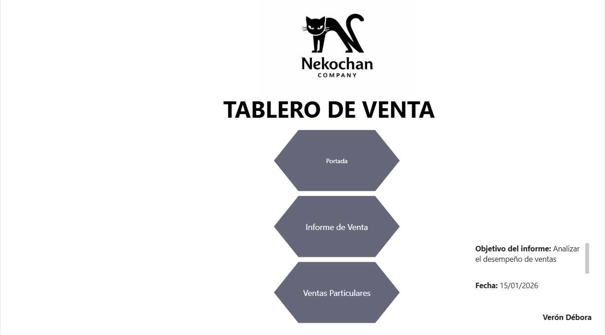
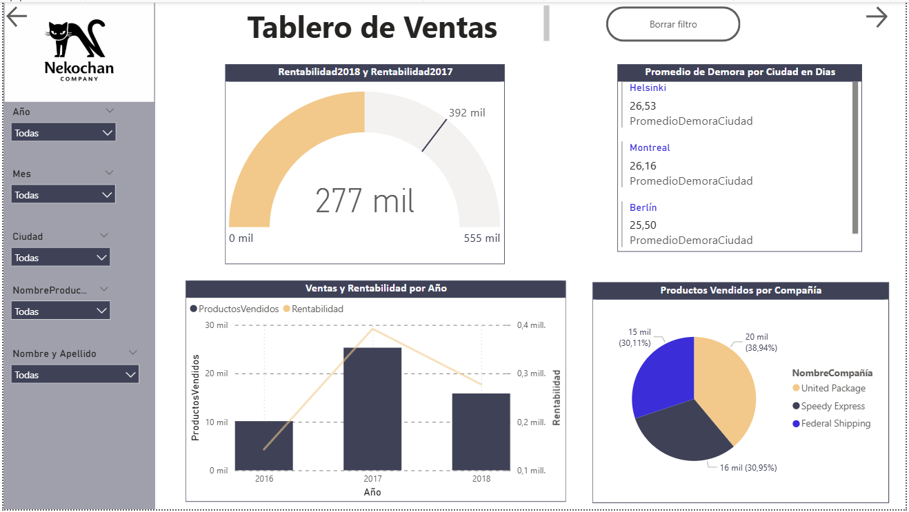
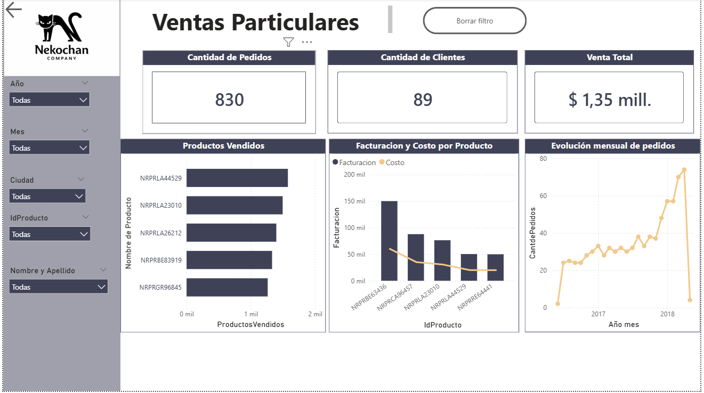

# Informe de Análisis de Ventas desarrollado como evaluación en la Diplomatura en Data Analytics de ICARO. El proyecto abarca desde el modelado de datos hasta la creación de un dashboard interactivo en Power BI, permitiendo monitorear KPIs clave y el rendimiento comercial de una empresa.

Portada

Informe de Ventas

Ventas Particulares
